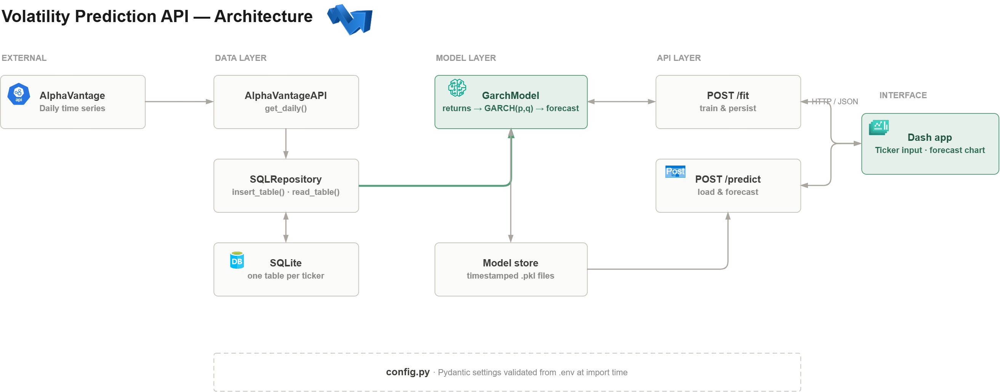

# Volatility-Prediction-India

## Purpose
This project predicts short-term stock volatility for equities listed on the Bombay Stock Exchange, serves those predictions through a web API, and presents them in an interactive dashboard. Daily price data is retrieved from the AlphaVantage API, transformed and persisted to a SQLite database through an object-oriented data layer, and used to fit a GARCH model. A FastAPI service exposes endpoints to train a model on demand and to generate a volatility forecast for a given horizon, with trained models serialised to disk so predictions can be served without refitting. A Dash application sits on top as the user-facing interface, calling the API over HTTP rather than importing the model directly — so the modelling service and the interface remain independently deployable.

## Architecture


## Data Flow
1. **Data Extraction:** The `AlphaVantageAPI` class requests a daily time series for a given ticker and parses the JSON response into a DataFrame indexed by date.
2. **Data Storage:** The `SQLRepository` class writes each ticker's price history to its own table in a SQLite database and reads it back on demand.
3. **Data Transformation:** Prices are sorted chronologically and converted into percentage returns, the input series a GARCH model requires.
4. **Model Training:** A GARCH(p, q) model is fitted to the return series, with AIC and BIC captured as fit diagnostics.
5. **Model Persistence:** Fitted models are serialised to disk with an ISO timestamp so the most recent model per ticker can be reloaded later.
6. **Model Serving:** A FastAPI application exposes `/fit` and `/predict` endpoints, returning validated JSON responses.
7. **User Interface:** A Dash application collects the ticker and forecast parameters, posts them to the API, and renders the returned forecast.

## Technologies Used
- **Python:** Core language for the data layer, model, and API.
- **AlphaVantage API:** Source of daily equity price data.
- **pandas:** Data parsing, transformation, and return calculation.
- **arch:** Provides the GARCH implementation used for volatility modelling.
- **SQLite:** Lightweight persistence layer for price history.
- **FastAPI:** Web framework serving the model.
- **Pydantic:** Request and response validation, and environment settings management.
- **joblib:** Model serialisation.
- **Dash / Plotly:** Interactive front end for selecting a ticker and visualising the forecast.

## Data Model
Each ticker is stored as its own table in `stocksdata.sqlite`, keyed by date.

| Column | Type | Description |
| --- | --- | --- |
| `date` | datetime | Trading date (index) |
| `open` | float | Opening price |
| `high` | float | Session high |
| `low` | float | Session low |
| `close` | float | Closing price, used to derive returns |
| `volume` | float | Shares traded |

**Tickers analysed**

| Ticker | Company | Observations | Date range |
| --- | --- | --- | --- |
| `SUZLON.BSE` | Suzlon Energy | 4,729 | Oct 2005 – Dec 2024 |
| `AMBUJACEM.BSE` | Ambuja Cements | 4,921 | Jan 2005 – Dec 2024 |

## The Pipeline
The project consists of the following components:

1. **Configuration:** Load secrets and paths from a `.env` file with validation.
2. **Data Layer:** Fetch from the API and persist to SQLite.
3. **Model Layer:** Wrangle returns, fit GARCH, forecast, and serialise.
4. **API Layer:** Expose fit and predict endpoints with validated schemas.

### Configuration — `config.py`

Settings are validated at import time by Pydantic rather than read ad hoc, so a missing key fails immediately with a clear error instead of surfacing later as a failed API call.

```python
from pydantic_settings import BaseSettings

def return_full_path(filename: str = ".env") -> str:
    """Uses os to return the correct path of the `.env` file."""
    absolute_path = os.path.abspath(__file__)
    directory_name = os.path.dirname(absolute_path)
    return os.path.join(directory_name, filename)

class Settings(BaseSettings):
    alpha_api_key: str
    db_name: str
    model_directory: str

    class Config:
        env_file = return_full_path(".env")

settings = Settings()
```

Resolving the `.env` path relative to the module file means the application behaves the same regardless of the working directory it is launched from.

### Data Layer — `data.py`

`AlphaVantageAPI` handles the request and the shape of the response. The API key is stored as a private attribute, and an unrecognised ticker raises immediately rather than failing further downstream:

```python
class AlphaVantageAPI:
    def __init__(self, api_key=settings.alpha_api_key):
        self.__api_key = api_key

    def get_daily(self, ticker, output_size="full"):
        url = (
            "https://learn-api.wqu.edu/1/data-services/alpha-vantage/query?"
            "function=TIME_SERIES_DAILY&"
            f"symbol={ticker}&"
            f"outputsize={output_size}&"
            f"datatype=json&"
            f"apikey={self.__api_key}"
        )

        response = requests.get(url=url)
        response_data = response.json()

        if 'Time Series (Daily)' not in response_data.keys():
            raise Exception(
                f"Invalid API call. Check that the ticker symbol '{ticker}' is correct"
            )

        stock_data = response_data['Time Series (Daily)']
        df = pd.DataFrame.from_dict(stock_data, orient="index", dtype=float)

        df.index = pd.to_datetime(df.index)
        df.index.name = "date"

        # AlphaVantage returns "1. open", "2. high" — strip the numbering
        df.columns = [c.split(". ")[1] for c in df.columns]

        return df
```

`SQLRepository` isolates all database access behind two methods, so the model layer never writes SQL directly and the storage backend could be swapped without touching the modelling code:

```python
class SQLRepository:
    def __init__(self, connection):
        self.connection = connection

    def insert_table(self, table_name, records, if_exists="fail"):
        n_inserted = records.to_sql(
            name=table_name, con=self.connection, if_exists=if_exists
        )
        return {'transaction_successful': True, 'records_inserted': n_inserted}

    def read_table(self, table_name, limit=None):
        if limit:
            sql = f"SELECT * FROM '{table_name}' LIMIT {limit}"
        else:
            sql = f"SELECT * FROM '{table_name}'"

        return pd.read_sql(
            sql=sql, con=self.connection,
            parse_dates=['date'], index_col='date'
        )
```

### Model Layer — `model.py`

`GarchModel` owns the full lifecycle for one ticker: sourcing data, fitting, forecasting, and persistence.

**Wrangling.** Returns are computed as percentage change in the closing price. The `* 100` scaling matters — GARCH optimisers converge poorly on raw decimal returns, which is why `rescale=False` can then be set safely at fit time.

```python
def wrangle_data(self, n_observations):
    if self.use_new_data:
        api = AlphaVantageAPI()
        new_data = api.get_daily(ticker=self.ticker)
        self.repo.insert_table(
            table_name=self.ticker, records=new_data, if_exists="replace"
        )

    df = self.repo.read_table(table_name=self.ticker, limit=n_observations + 1)
    df.sort_index(ascending=True, inplace=True)

    df["return"] = df["close"].pct_change() * 100
    self.data = df["return"].dropna()
```

The `n_observations + 1` is deliberate: `pct_change()` consumes the first row, so one extra observation is retrieved to end up with the requested number of returns.

**Fitting.**

```python
def fit(self, p, q):
    self.model = arch_model(self.data, p=p, q=q, rescale=False).fit(disp=0)
    self.aic = self.model.aic
    self.bic = self.model.bic
```

**Forecasting.** The `arch` library forecasts *variance*; volatility is its square root. Forecast dates are generated with `bdate_range` so predictions land on trading days rather than calendar days, and are formatted as ISO 8601 strings for clean JSON serialisation:

```python
def __clean_prediction(self, prediction):
    start = prediction.index[0] + pd.DateOffset(days=1)
    prediction_dates = pd.bdate_range(start, periods=prediction.shape[1])
    prediction_index = [d.isoformat() for d in prediction_dates]

    # Variance → volatility
    data = np.sqrt(prediction.values.flatten())

    return pd.Series(data, index=prediction_index).to_dict()

def predict_volatility(self, horizon):
    prediction = self.model.forecast(horizon=horizon, reindex=False).variance
    return self.__clean_prediction(prediction)
```

**Persistence.** Models are saved with an ISO timestamp prefix, so a sorted glob returns the most recent model for a ticker without needing a registry:

```python
def dump(self):
    timestamp = pd.Timestamp.now().isoformat()
    filepath = os.path.join(self.model_directory, f"{timestamp}_{self.ticker}.pkl")
    joblib.dump(self.model, filepath)
    return filepath

def load(self):
    pattern = os.path.join(self.model_directory, f"*{self.ticker}.pkl")
    try:
        model_path = sorted(glob(pattern))[-1]
    except IndexError:
        raise Exception(f"No model trained for {self.ticker}")

    self.model = joblib.load(model_path)
```

### API Layer — `main.py`

Request and response schemas are declared as Pydantic models, so FastAPI validates input, serialises output, and generates interactive documentation automatically.

```python
class FitIn(BaseModel):
    ticker: str
    use_new_data: bool
    n_observations: int
    p: int
    q: int

class FitOut(FitIn):
    success: bool
    message: str

class PredictIn(BaseModel):
    ticker: str
    n_days: int

class PredictOut(PredictIn):
    success: bool
    forecast: dict
    message: str
```

Having `FitOut` inherit from `FitIn` means the response echoes back the parameters that produced it, so a caller always knows which configuration a result came from.

A factory function wires up the database connection and repository per request:

```python
def build_model(ticker, use_new_data):
    connection = sqlite3.connect(settings.db_name, check_same_thread=False)
    repo = SQLRepository(connection=connection)
    return GarchModel(ticker=ticker, use_new_data=use_new_data, repo=repo)
```

**`POST /fit`** — downloads data if requested, fits the model, saves it, and returns the fit diagnostics:

```python
@app.post("/fit", status_code=200, response_model=FitOut)
def fit_model(request: FitIn):
    response = request.dict()
    try:
        model = build_model(ticker=request.ticker, use_new_data=request.use_new_data)
        model.wrangle_data(n_observations=request.n_observations)
        model.fit(p=request.p, q=request.q)
        filename = model.dump()

        response["success"] = True
        response["message"] = (
            f"Trained and saved '{filename}'. "
            f"Metrics: AIC {model.aic}, BIC {model.bic}."
        )
    except Exception as e:
        response["success"] = False
        response["message"] = str(e)

    return response
```

**`POST /predict`** — loads the most recent saved model and returns the forecast:

```python
@app.post("/predict", status_code=200, response_model=PredictOut)
def get_prediction(request: PredictIn):
    response = request.dict()
    try:
        model = build_model(ticker=request.ticker, use_new_data=False)
        model.load()
        prediction = model.predict_volatility(horizon=request.n_days)

        response["success"] = True
        response["forecast"] = prediction
        response["message"] = ""
    except Exception as e:
        response["success"] = False
        response["forecast"] = {}
        response["message"] = str(e)

    return response
```

Both endpoints always return HTTP 200 with a `success` flag rather than raising HTTP errors, so clients parse one consistent response shape and read the failure reason from `message`.

## API Reference

### `POST /fit`

```json
{
  "ticker": "SUZLON.BSE",
  "use_new_data": true,
  "n_observations": 2000,
  "p": 1,
  "q": 1
}
```

Response:

```json
{
  "ticker": "SUZLON.BSE",
  "use_new_data": true,
  "n_observations": 2000,
  "p": 1,
  "q": 1,
  "success": true,
  "message": "Trained and saved '.../2024-12-26T10:15:00_SUZLON.BSE.pkl'. Metrics: AIC 8123.4, BIC 8146.1."
}
```

### `POST /predict`

```json
{
  "ticker": "SUZLON.BSE",
  "n_days": 5
}
```

Response:

```json
{
  "ticker": "SUZLON.BSE",
  "n_days": 5,
  "success": true,
  "forecast": {
    "2024-12-27T00:00:00": 3.42,
    "2024-12-30T00:00:00": 3.38,
    "2024-12-31T00:00:00": 3.35
  },
  "message": ""
}
```

Forecast values are daily volatility in percentage points.

## User Interface
A Dash application provides the front end. It collects the ticker and model parameters, posts them to the FastAPI service, and plots the returned forecast.


The application communicates with the model only over HTTP, so the two run as separate processes:

```python
import requests

response = requests.post(
    "http://127.0.0.1:8000/predict",
    json={"ticker": ticker, "n_days": n_days}
)
forecast = response.json()["forecast"]
```

Keeping the boundary at HTTP rather than importing `GarchModel` into the Dash app means the API can be deployed, scaled, or replaced independently of the interface, and the same endpoints remain available to any other client.

## Repository Structure
```
Volatility_Prediction_in_India/
├── API_FOLDER/
│   ├── config.py                  # Pydantic settings from .env
│   ├── data.py                    # AlphaVantageAPI + SQLRepository
│   ├── model.py                   # GarchModel
│   ├── main.py                    # FastAPI application
│   ├── app.py                     # Dash front end
│   └── stocksdata.sqlite          # Cached price history
├── notebooks/
│   ├── exploring_data.ipynb       # Exploratory analysis
│   └── volatility_prediction.ipynb # Model development
├── .env.example
├── requirements.txt
└── README.md
```

## Development Setup

Clone and install dependencies:

```bash
git clone https://github.com/IDOWUMAYOWA/Volatility_Prediction_in_India.git
cd Volatility_Prediction_in_India
pip install -r requirements.txt
```

Create a `.env` file inside `API_FOLDER/`:

```
ALPHA_API_KEY=your_alphavantage_key
DB_NAME=stocksdata.sqlite
MODEL_DIRECTORY=models
```

A free AlphaVantage key is available at https://www.alphavantage.co/support/#api-key.

Run the API:

```bash
cd API_FOLDER
uvicorn main:app --reload
```

Interactive documentation is then available at `http://127.0.0.1:8000/docs`, where both endpoints can be called directly from the browser.

Then start the Dash app in a second terminal, leaving the API running:

```bash
cd API_FOLDER
python app.py
```

The interface is served at `http://127.0.0.1:8050`.

## Modelling Notes
- **Why GARCH.** Financial returns exhibit volatility clustering — turbulent periods follow turbulent periods. GARCH models conditional variance as a function of past squared returns and past variance, which captures that persistence in a way a constant-variance assumption cannot.
- **Returns, not prices.** Price series are non-stationary; percentage returns are approximately stationary, which is what the model requires.
- **Variance versus volatility.** The `arch` forecast returns variance, so the square root is taken before the values are returned to the caller.
- **Business days.** Forecast dates use `bdate_range`, so a five-day forecast made on a Friday runs to the following Friday rather than including the weekend.
- **Model selection.** AIC and BIC are returned on every fit, allowing different `(p, q)` combinations to be compared without re-instrumenting the code.
